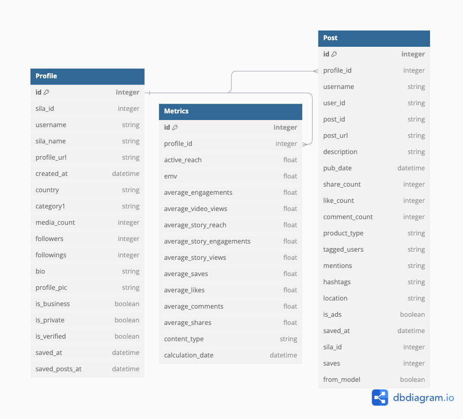

## Social Media Metrics

This project will be used to create an API server to calculate, store and fetch social media metrics:

- FastAPI
- SQLAlchemy (ORM)
- Pydantic (Dataparsing and Serialization)
- Pandas
- Docker-Compose (Running multiple containers)

## Database ERD

### Figure

The data will be stored in a `Metrics` Table.



Use this [link](https://dbdiagram.io/d/672cc68de9daa85acaaae3b3) to view online.

## Usage

### Run Locally [Requires Database Setup]

Follow the steps to setup this project.

Go to the Project Folder and run the command:

```
source env/bin/activate
```

Now go inside the `app` folder

```
cd app
```

Install the required packages.

```
pip install -r requirements.txt
```

Run the server locally:

```
fastapi dev main.py
```

### Run on containers

Inside the `app` folder. Run the following command:

```
docker-compose up --build
```

Expected Output:

```
fastapi_app  | INFO:     Started server process [1]
fastapi_app  | INFO:     Waiting for application startup.
fastapi_app  | INFO:     Application startup complete.
fastapi_app  | INFO:     Uvicorn running on http://0.0.0.0:8000 (Press CTRL+C to quit)
```

Now go to the following url to view the docs for the APIs:

```
http://localhost:8000/docs
```

To shut down the containers. Use the command:

```
docker-compose down
```

Sample Output:

```
[+] Running 3/3
 ✔ Container fastapi_app  Removed      0.0s
 ✔ Container mysql_db     Removed      0.0s
 ✔ Network app_default    Removed      0.1s
```

## Testing

Check the documents of the API routes and send requests using the swagger UI at the [doc](http://localhost:8000/docs) after running the server. Sample test data `.csv` files are located at `app/test/data`.

### Sample Results

On sending the POST Request on the `/compute_metrics` endpoint, It will store the general metrics in the database and return them classified based on `Organic/Paid`.

Sample Result:

```
{
  "metrics_paid": {
    "active_reach": 61081.6,
    "emv": 517648.2883,
    "average_engagements": 10258.15,
    "average_video_views": 50823.45,
    "average_story_reach": 0,
    "average_story_engagements": 0,
    "average_story_views": 0,
    "average_saves": 648.425,
    "average_likes": 10158.375,
    "average_comments": 99.775,
    "average_shares": 0
  },
  "metrics_organic": {
    "active_reach": 91943.6506849315,
    "emv": 8178600.258300001,
    "average_engagements": 9709.826484018266,
    "average_video_views": 82233.82420091324,
    "average_story_reach": 0,
    "average_story_engagements": 0,
    "average_story_views": 0,
    "average_saves": 592.8493150684932,
    "average_likes": 9589.739726027397,
    "average_comments": 120.08675799086758,
    "average_shares": 0
  }
}
```

To get the metrics based on some `username`, we can send the request to the `/metrics/{username}` endpoint.

Sample Result:

```
[
  {
    "id": 1,
    "profile_id": 14052,
    "active_reach": 89588.8,
    "followers": 534223,
    "country": "Saudi Arabia",
    "username": "bo3omar22",
    "profileUrl": "https://www.instagram.com/bo3omar22",
    "postCount": 8,
    "emv": 242463,
    "average_engagements": 22934.5,
    "average_video_views": 66654.2,
    "average_story_reach": 0,
    "average_story_engagements": 0,
    "average_story_views": 0,
    "average_saves": 1848.12,
    "average_likes": 22664.4,
    "average_comments": 270.125,
    "average_shares": 0,
    "calculation_date": "2024-11-09T07:20:25"
  }
]
```

Note: It returns a list as there can be multiple metrics saved for a single user based on the `calculation_date`. This will help to classify a single user data based on timelines.

## Folder Structure

All the project code is in the `app` folder with following sub-folders acting as different python packages.

- **/controller** : It contains the all the logic of the functions to calculate ,store and fetch the metrics.
- **/db** : It contains database related helper functions and variables.
- **/models** : It contains the ORM classes for the `Metrics` Table.
- **/utils** : It contains the helper functions like to parse data or utilizing logging functionality.
- **/schemas** : It contains the pydantic classes that will be used for data validation, parsing and serialization when interacting with the `controller` functions.
- **/test** : It contains the test data for the database.
