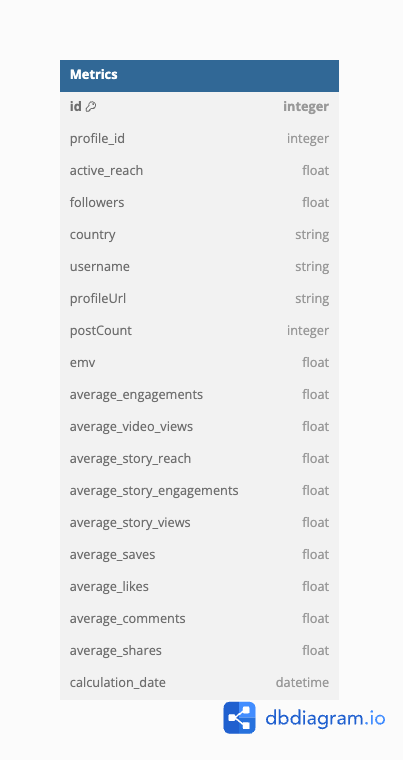

## User Social Media Metrics

This app utilizes FastAPI, Pandas and SQLAlchemy(ORM) to make an API to calculate, store and fetch user's social media metrics.

## ERD

We are using relational database to store data, so the diagram for the table's relations is as follow:



The link for the `diagramdb.io` is [here](https://dbdiagram.io/d/672cc68de9daa85acaaae3b3)

## Running Instructions

### Run Locally

Switch to the python environment:

```
source env/bin/activate
```

Run the server locally:

```
fastapi dev app/main.py
```

### Run on containers

Run the containers using `docker-compose`:

```
docker-compose up --build
```
